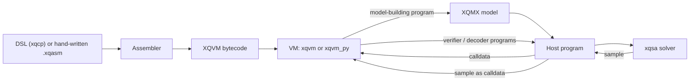

# Toolchain Map

XQuad turns one problem description into bytecode that runs unchanged on
any backend it supports. This page names the pieces that make that true,
and what each one consumes and produces.



| Component | Role | Hands off |
|---|---|---|
| DSL (`xqcp`) or `.xqasm` source | Describes the problem: a program whose job is to build a model, in Python or in assembly text | `.xqasm` source |
| Assembler (`xqasm`) | Parses `.xqasm` text and resolves labels | XQVM bytecode (`.xqb`) |
| Bytecode | The portable artifact: identical bytes run on the Rust `xqvm` interpreter or the Python `xqvm_py` reference VM | Input to the VM |
| VM (`xqvm` / `xqvm_py`) | Executes bytecode against [calldata](../xqvm/io.md) the host program supplies | An `XqmxModel`, when the program's job is building one; decoded output, when its job is reading a sample back |
| Model (`XqmxModel`) | The Hamiltonian a model-building program assembled: the model's energy function, covered in [Quadratic Models](quadratic-models.md) | Input to a solver |
| Solver (`xqsa`) | Minimises the model's Hamiltonian | An `XqmxSample`: the best assignment found |
| Host program | The script or CLI session driving every stage above | Reads the model out of the VM and hands it to the solver, then feeds the sample back in as calldata (the numbered input slots a host fills before each VM run) for the next run |

## Following the Pipeline

A hand-written program can skip most of this. Save the following as
`add.xqasm`:

```asm
; push two integers and add them
PUSH 10
PUSH 32
ADD
HALT
```

```sh
$ xquad asm add.xqasm -o add.xqb
assembled 4 instructions (21 bytes) -> add.xqb
$ xquad run add.xqb
stack (bottom to top):
  42
```

Here the pipeline is just two rows: the assembler and the VM. The `xquad`
CLI plays the host program's role, reading `add.xqb` from disk and
printing the result, and that already runs the real toolchain end to end.
[XQVM Reference](../xqvm/README.md) walks through this same `add.xqasm`
again, from the machine's side: what each instruction does to the stack as
it runs.

A problem worth handing to a solver uses every row in the table above.
`xqcp` compiles a `Problem` into three separate `.xqasm` programs, not one
-- see [Three Programs](three-programs.md) for what those three are and
why. The first one builds a model; `xqsa` solves it; the other two check
and decode the answer. A Python host program -- `xquad.program`,
`xqffi.vm`, or a full `xqcp` pipeline -- drives it, injecting calldata
before each VM run and reading outputs back after. See
[Ways to Use XQuad](ways-to-use.md) for which surface plays that host-program
role in each of the six ways to work with XQuad.

## Where to Go From Here

- **[Ways to Use XQuad](ways-to-use.md)** -- the six surfaces that build a
  model and drive execution, and how to pick one.
- **[Quadratic Models](quadratic-models.md)** -- what the model in the
  middle of this pipeline actually is, and why constraints become part of
  it.
- **[Three Programs](three-programs.md)** -- why `xqcp` compiles a problem
  into three separate programs instead of one.
- **[Backends](backends.md)** -- the solvers that sit in the gap between
  encoder and verifier.

Past this chapter: [Modelling](../modelling/README.md) builds a model with
the DSL, [Running Programs](../running/README.md) and
[Solving Overview](../solving/README.md) execute it and hand it to a
solver, and [XQVM Reference](../xqvm/README.md) is the machine this whole
pipeline compiles down to.
