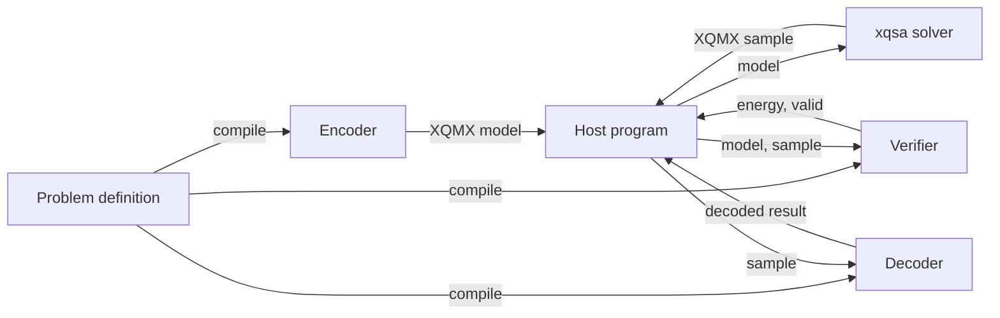

# Three Programs

An optimisation problem in XQuad is three independent programs sharing one
instruction set: an encoder, a verifier, and a decoder. They communicate
only through [calldata](../xqvm/io.md) in and outputs out. `xqvm`'s
[Three-Program Architecture](https://gitlab.com/quip.network/xquad/-/blob/main/spec/xqvm/SPEC.md)
defines this shape, so it is not something `xqcp` adds on top. Nothing in
the instruction set enforces it -- see [Beyond `xqcp`](#beyond-xqcp) -- but
every tool in the toolchain assumes it.

`xqcp` generates all three for you from one `Problem` definition:
`problem.compile()` returns `CompiledPrograms(encoder, verifier, decoder)`,
three independent `.xqasm` sources, each its own complete program with its
own fixed inputs and outputs. A hand-written program can follow the same
shape with no DSL involved: `xqvm/examples/tsp/main.rs` builds and runs a
three-program TSP pipeline directly against the Rust `xqvm` crate.

## Why Three, Not One

XQVM has no instruction that calls a solver. Its 93 instructions cover
control flow, stack and register I/O, arithmetic, comparison, vectors,
grid operations, the constraint and energy family -- nothing that reaches
outside the VM to an annealer or a sampler. Solving happens in host code,
between two runs of the VM, using whichever backend
[Backends](backends.md) describes. A model-building program cannot also be
the program that checks and decodes the answer, because the answer does
not exist yet when that program halts.



## What Each Program Does

**Encoder.** Reads the problem's runtime inputs from
calldata, allocates the XQMX model, and emits every
objective term and constraint penalty the DSL recorded. Its one output is
the model, on slot 0. This is "a program whose job is to construct a
model" -- running it does not solve anything, it only builds the thing a
solver will minimise.

**Verifier.** Takes a fixed input layout -- model, sample, and variable
count `N` -- and checks whether the sample satisfies the constraints the
encoder applied, then computes the sample's energy with the `ENERGY`
opcode. It outputs `(energy, valid)`. This is how a compiled sample's
quality gets checked independently of whatever backend produced it, when
the problem has constraints for it to check.

**Decoder.** Takes a sample and `N`, and extracts the answer in the
problem's own terms -- a tour, a partition, a set of selected items --
into one or more output vectors. It does not know or care whether the
sample it was given is valid; that is the verifier's job, not the
decoder's.

## Independent, Not Sequential

The three programs share no state. Communication between them happens
only through calldata in and outputs out -- there is no hidden channel, and
no program reads another program's internals. The verifier and the decoder
are not a pipeline: both read the same sample straight from the solver, at
the same point, side by side. A host program can
decode a sample the verifier just rejected, which is useful for inspecting
what a bad solution actually looks like.

## A Concrete Run

`examples/maxcut/runner.py` is exactly this shape. Max-Cut declares no
constraints, so its verifier's constraint check is empty: the loop under
`; === Validity checks ===` in the compiled verifier only confirms each
sample value is 0 or 1. The `ENERGY` recomputation still runs and is real
independent verification -- the energy the verifier reports is computed
fresh from the model and the sample, not relayed from the solver.

Its `run()` function makes four calls in sequence, three of them through
the VM:

1. `vm.run(programs.encoder)` with calldata `[n, flat_edges]` and one
   [output slot](../xqvm/io.md), producing an `XQMX` model.
2. `solver.solve(model)`, entirely outside the VM, producing a sample.
3. `vm.run(programs.verifier)` with calldata `[model, sample, n]` and two
   output slots, producing `(energy, valid)`.
4. `vm.run(programs.decoder)` with calldata `[sample, n]` and one output
   slot, producing the decoded partition.

Running `uv run python examples/maxcut/runner.py --n 5 --seed 42` prints:

```text
$ uv run python examples/maxcut/runner.py --n 5 --seed 42
{
  "_note": "canonical CI golden",
  "_seed": 42,
  "cut_weight": 354,
  "energy": -354,
  "n": 5,
  "partition": [
    0,
    1,
    0,
    0,
    1
  ],
  "valid": 1
}
```

Adding `--interpreter rust` to the same command prints that block byte for
byte for this seed. That is not a guarantee: the encoder, verifier, and
decoder are deterministic per interpreter -- same bytecode in, same
output out, on either one -- but the solve sitting between them is only
pinned to the seed and the `dwave-samplers` version, since SA is
sensitive to BQM construction order. A different version of that library
can return a different valid sample for the same seed. See below for
what `make example-smoke` actually
checks instead of byte-for-byte parity.

`_note` and `_seed` are the runner's own bookkeeping, not part of the
result: `_note`'s value, `"canonical CI golden"`, describes what the
runner calls this invocation, not a guarantee that a test pins against
it. `energy` is the negative of `cut_weight` because the encoder
minimises `-weight` per crossing edge to make the objective function,
matching the derivation in
[Quadratic Models](quadratic-models.md#a-worked-example-max-cut).
`valid: 1` here only confirms every sample value is in `{0, 1}`, which is
all this problem's verifier checks. `make example-smoke` is what actually
guards this example: it runs both interpreters and checks `valid == 1`,
and does not compare `cut_weight`, `energy`, or `partition` between them.
These numbers depend on the `dwave-samplers` version behind `dwave-cpu`;
a different version can return a different valid sample with a different
cut weight.

The three VM calls above, and the solve between them, are the host program
driving all three compiled programs and the solver together -- see
[Ways to Use XQuad](ways-to-use.md) for the surfaces that can play that
role.

## Beyond `xqcp`

A hand-assembled `.xqasm` program is free to read inputs, build a model,
and produce output in one file, the way [Toolchain Map](./)'s
minimal `add.xqasm` example does -- the interpreter does not enforce the
three-program split. The split earns its cost once an external solver sits
in the loop and a sample needs independent checking, which is exactly when
reaching for `xqcp`, or hand-writing the same three-program shape, starts
to pay off. See [Modelling: Compiling](../modelling/compiling.md) for how
the compiler produces the three programs, and
[Running Programs](../running/) and
[Solving Overview](../solving/) for executing each stage.
