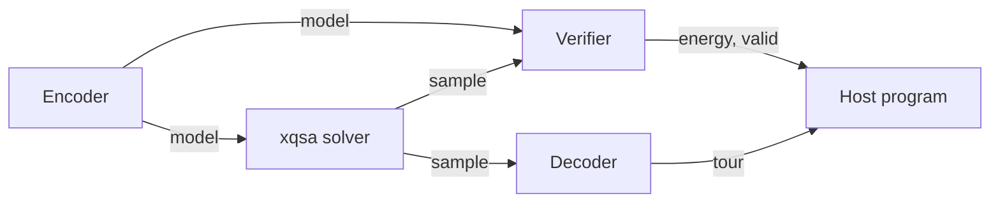
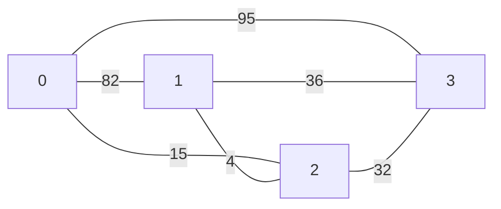

<!--
  AUTO-GENERATED FILE. DO NOT EDIT.
  This file is regenerated from `examples/manifest.yaml and examples/*/README.md` by
  `scripts/gen-example-docs.py`.
  Edit the source README or manifest, then run `make regen-docs`.
-->

# Travelling Salesman Problem

Source: [examples/tsp/README.md](https://gitlab.com/quip.network/xquad/-/blob/main/examples/tsp/README.md)

Find the shortest Hamiltonian tour through N cities given a random symmetric
distance matrix.

## QUBO formulation

- **Input**: `num_cities` (int), `distance_matrix` (Vec, flat upper triangle, `n*(n-1)/2` entries)
- **Model**: an `n x n` binary grid. `x[i, p] = 1` means city `i` is at tour position `p`.
- **Objective**: sum of distances between consecutive positions in the tour.
- **Constraints**: one-hot row (each city at exactly one position) and one-hot column (each position holds exactly one city), both with penalty 100.

## Hamiltonian

The Hamiltonian is the sum of three terms:

$$H = H_{\text{dist}} + H_{\text{row}} + H_{\text{col}}$$

\\(H_{\text{dist}}\\) is the tour length. For every pair of cities \\(i < j\\) and
every position \\(p\\), a term fires whichever direction the tour visits them
in -- city `i` at `p` and city `j` at the next position, or the reverse:

$$H_{\text{dist}} = \sum_{i<j} \sum_{p=0}^{n-1} d_{ij} \left( x_{i,p}\, x_{j,(p+1) \bmod n} + x_{j,p}\, x_{i,(p+1) \bmod n} \right)$$

\\(H_{\text{row}}\\) and \\(H_{\text{col}}\\) are the one-hot constraints
`apply_onehot_row` and `apply_onehot_col` add, at penalty \\(P = 100\\):

$$H_{\text{row}} = P \sum_{i=0}^{n-1} \left( \sum_{p=0}^{n-1} x_{i,p} - 1 \right)^2, \qquad H_{\text{col}} = P \sum_{p=0}^{n-1} \left( \sum_{i=0}^{n-1} x_{i,p} - 1 \right)^2$$

XQMX has no field for a constant term. Each satisfied one-hot constraint
drops its `+P` and leaves `-P` in the stored model instead of `0` -- see
[Constraints](../modelling/constraints.md#why-the-reported-energy-is-not-just--total_value).

\\(H_{\text{row}}\\) forces each city onto exactly one position; \\(H_{\text{col}}\\)
forces each position to hold exactly one city. Both terms are zero *as
written* on a valid tour, so they never change which valid tour is
shortest -- but because of the dropped constant above, what a satisfied
constraint actually contributes is `-P`, not `0`, which is where the
worked example's `-800` below comes from. A violation (a city visiting
two positions, or a position holding two cities) still costs more than a
satisfied constraint.

Whether that makes every invalid grid's energy exceed every valid
tour's depends on \\(P\\) relative to the tour-length difference a
violation can buy back.
[Constraints](../modelling/constraints.md#choosing-a-penalty-weight)
gives the general criterion. At \\(P = 100\\) it holds for this
seed-42, 4-city instance. The best invalid grid scores `-581`, `6`
above the worst valid tour's `-587`. It does not hold at every instance
where \\(P = 100\\) is used. At `--n 5 --seed 7`, the second command
under Usage below, an invalid grid scores `-770`, below `40` of the
`120` valid tours.

## DSL methods used

- `problem.input()` -- declare typed calldata inputs
- `problem.define_model()` -- allocate binary 2D grid XQMX model
- `problem.stow()` -- bind intermediate computations to named registers
- `problem.range()` -- emit RANGE loops
- `model.quadratic[(city_i, pos), (city_j, pos)].add()` -- accumulate quadratic coupling using 2D grid coordinates
- `model.apply_onehot_row()` -- ONEHOTR constraint per city
- `model.apply_onehot_col()` -- ONEHOTC constraint per position
- `problem.output()` -- declare typed output slots
- `problem.sample.colfind()` -- find the row index with value 1 in a given column

## Pipeline overview

1. **CP** (`xqcp`) -- build a random symmetric distance matrix, declare an `n x n` binary grid, and add quadratic distance terms plus one-hot row/column constraints.
2. **Assemble** -- `.xqasm` text to bytecode via `xquad.asm`
3. **Encode** -- run encoder on chosen XQVM to produce the XQMX model
4. **Sample** -- solver runs SA/QPU/GPU over the model
5. **Verify** -- verifier checks one-hot row/column constraints and computes energy
6. **Decode** -- decoder extracts the tour as a sequence of city indices

Steps 3-6 are three independent XQVM programs plus a solver call in between,
sharing data only through calldata and outputs:



The encoder's calldata is `num_cities, distance_matrix`; the verifier's is
`model, sample, num_cities`; the decoder's is `sample, num_cities`. See
[Three Programs](../concepts/three-programs.md) for why the
split exists.

## Worked example

`uv run python examples/tsp/runner.py --n 4 --seed 42` builds this
4-city instance (edge labels are `distance_matrix`, indexed by the
upper-triangle position of each city pair):



Both interpreters return the same tour:

```json
{
  "_note": "canonical CI golden",
  "_seed": 42,
  "energy": -650,
  "n": 4,
  "tour": [0, 2, 1, 3],
  "tour_distance": 150,
  "valid": 1
}
```

`tour_distance` is `d(0,2) + d(2,1) + d(1,3) + d(3,0) = 15 + 4 + 36 + 95 =
150`, matching \\(H_{\text{dist}}\\) for a valid tour. `energy` is
`H_{\text{dist}} + H_{\text{row}} + H_{\text{col}}`: on a valid tour, each
of the 4 rows and 4 columns contributes its one active variable's `-P`
linear term and nothing from the quadratic term (no two variables in the
same row or column are both 1), for `-P * n` per constraint family, so
`energy = tour_distance - 2 * P * n = 150 - 2 * 100 * 4 = -650`, matching
the run.

## Usage

```sh
uv run python examples/tsp/runner.py --seed 42
uv run python examples/tsp/runner.py --n 5 --seed 7 -o /tmp/tsp.json
```

| Flag | Default | Description |
|------|---------|-------------|
| `--n` | `4` | Number of cities |
| `--solver` | `dwave-cpu` | Solver backend (see Choosing a solver) |
| `--interpreter` | `python` | XQVM backend: `python` or `rust` |
| `--seed` | `42` | Random seed |
| `-o` | stdout | Write JSON result to file |

## Choosing a solver

Solver selection and install extras are the same for every example: see
[Using the Examples](using-examples.md#running-one) and
[Solving Overview](../solving/). The default is `dwave-cpu`, and a
non-default solver will not reproduce the output shown here.

The canonical output and its invariants are defined in the [source README](https://gitlab.com/quip.network/xquad/-/blob/main/examples/tsp/README.md).
