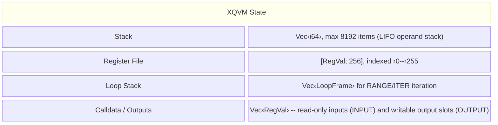

# VM Architecture

XQVM is a stack-based bytecode interpreter. A running VM holds four pieces of
mutable state:



## Design Principles

- **Stack-based computation** -- arithmetic and comparisons operate on an
  integer stack. This keeps the instruction set simple and compact.
- **Typed register file** -- registers hold polymorphic `RegVal` values (integers,
  vectors, models, samples). Type checking happens at runtime.
- **No heap / no pointers** -- there is no explicit memory allocation. Vectors
  and models grow dynamically within registers. Programs cannot address raw
  memory.
- **Deterministic execution** -- given the same program, calldata, and
  configuration, the VM always produces the same output. There are no
  random instructions or non-deterministic operations.
- **Embeddable** -- the VM crate supports `no_std + alloc`, enabling deployment
  in WASM runtimes and bare-metal environments.

## Chapters

- Operand stack -- the `i64` value stack
- Register file -- the 256-slot typed register array
- [Loop Stack](loops.md) -- range and iterator loop frames
- [Calldata and Outputs](io.md) -- external I/O slots
- [Execution Model](execution.md) -- the fetch-decode-execute cycle

## Operand Stack

The operand stack is the primary workspace for computation. It holds `i64`
signed 64-bit integers and is used by arithmetic, comparison, logical, and
bitwise instructions.

### Properties

| Property | Value |
|----------|-------|
| Element type | `i64` (signed 64-bit integer) |
| Maximum depth | 8,192 items |
| Ordering | LIFO (last in, first out) |
| Initial state | Empty |

### Operations

- **Push** -- `PUSH1`--`PUSH8` push constants. `LOAD` pushes a register's
  integer value. `COPY` duplicates the top element.
- **Pop** -- most instructions implicitly pop their operands. `POP` explicitly
  discards the top element.
- **Swap** -- `SWAP` exchanges the top two elements.
- **Clear** -- `SCLR` removes all elements.

### Stack Diagrams

Throughout this documentation, stack effects are written as:

$$[\ldots, a, b] \to [\ldots, r]$$

- \\(\ldots\\) represents elements below the operands.
- Rightmost = **top** of stack.
- \\(b\\) is popped first (it was pushed last).
- \\(r\\) is the result pushed after the operation.

### Errors

- **`StackUnderflow`** -- popping from an empty stack or when there are fewer
  elements than the instruction requires.
- **`StackOverflow`** -- pushing when the stack already contains 8,192 items.

### Interaction with Registers

The stack holds only `i64` integers. Richer types (models, vectors, samples)
live exclusively in registers. The bridge between them:

- `LOAD reg` -- pushes a register's `Int` value onto the stack.
- `STOW reg` -- pops a stack value into a register as `Int`.

To move non-integer values, use `INPUT`/`OUTPUT` with calldata and output slots.

## Register File

The register file is a fixed array of 256 slots, indexed `r0` through `r255`.
Each slot holds a typed `RegVal` value.

### Properties

| Property | Value |
|----------|-------|
| Count | 256 (r0--r255) |
| Index type | `u8` |
| Value type | `RegVal` (polymorphic enum) |
| Default value | `Int(0)` for all slots |

### RegVal Variants

| Variant | Rust Type | Description |
|---------|-----------|-------------|
| `Int(i64)` | `i64` | Default. Exchanged with the stack via `LOAD`/`STOW`. |
| `VecInt(Vec<i64>)` | `Vec<i64>` | Integer vector. Created by `VEC`/`VECI`. |
| `VecXqmx(Vec<XqmxModel>)` | `Vec<XqmxModel>` | Vector of models. Created by `VECX`. |
| `Model(XqmxModel)` | struct | QUBO/Ising/discrete Hamiltonian. Created by `BQMX`/`SQMX`/`XQMX`. |
| `Sample(XqmxSample)` | struct | Variable-assignment vector. Created by `BSMX`/`SSMX`/`XSMX`. |

### Type Checking

Register access is type-checked at runtime. Instructions that expect a
specific variant (e.g. `LOAD` expects `Int`, `VECPUSH` expects `VecInt`,
`SETLINE` expects `Model`) will produce a `RegisterType` error if the register
holds a different variant. The error message includes the expected and actual
type names.

### XqmxModel Structure

A model represents a QUBO/Ising/discrete Hamiltonian:

```
XqmxModel {
    domain: Domain,                      // Binary | Spin | Discrete(k)
    size: usize,                         // number of variables
    linear: BTreeMap<usize, i64>,        // bias terms h_i
    quadratic: BTreeMap<(usize,usize), i64>,  // coupling terms J_{ij}
    rows: usize,                         // grid rows (set by RESIZE)
    cols: usize,                         // grid cols (set by RESIZE)
}
```

Coefficients are stored sparsely. Missing entries read as `0`; setting a
coefficient to `0` removes it from the map.

### XqmxSample Structure

A sample holds a vector of variable assignments:

```
XqmxSample {
    domain: Domain,        // must match the model's domain
    values: Vec<i64>,      // one value per variable
}
```

### Memory Management

There is no garbage collector. Registers hold their values until explicitly
overwritten. Use `DROP reg` to reset a register to `Int(0)`, releasing any
heap allocation (models, vectors, samples) it held.
